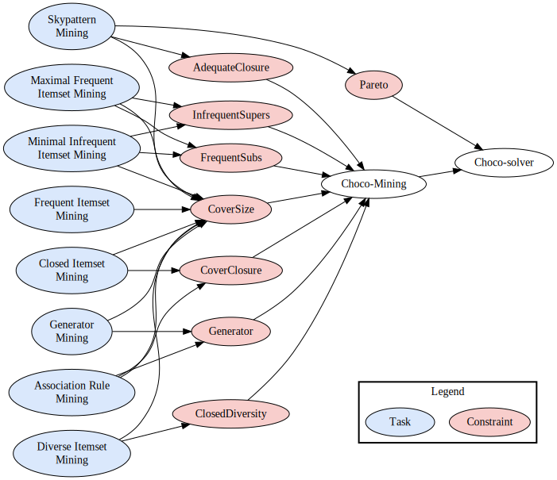

# Choco-Mining: A Java library for Itemset Mining with Choco Solver

Choco-Mining is a Java library for solving itemset mining problems that is based on [Choco-solver](https://github.com/chocoteam/choco-solver), which was utilized in the experiments of [VernereyLAL22]. Choco-solver is an open-source Java library designed for Constraint Programming (CP). One of the key benefits of utilizing CP in itemset mining problems is the flexibility it provides to add custom constraints to the problem without requiring modifications to the underlying system.

## Quick start example

In this example, we want to extract all the closed itemsets (i.e. the ones that have no superset with the same frequency) with a minimum frequency of 1 and a minimum length of 1.

```java
// Read the transactional database
TransactionalDatabase database = new DatReader("data/contextPasquier99.dat").read();
// Create the Choco model
Model model = new Model("Closed Itemset Mining");
// Array of Boolean variables where x[i] == 1 represents the fact that i belongs to the itemset
BoolVar[] x = model.boolVarArray("x", database.getNbItems());
// Integer variable that represents the frequency of x with the bounds [1, nbTransactions]
IntVar freq = model.intVar("freq", 1, database.getNbTransactions());
// Integer variable that represents the length of x with the bounds [1, nbItems]
IntVar length = model.intVar("length", 1, database.getNbItems());
// Ensures that length = sum(x)
model.sum(x, "=", length).post();
// Ensures that freq = frequency(x)
model.post(new Constraint("Cover Size", new CoverSize(database, freq, x)));
// Ensures that x is a closed itemset
model.post(new Constraint("Cover Closure", new CoverClosure(database, x)));
// Create a list to store all the closed itemsets
List<Pattern> closedPatterns = new LinkedList<>();
while (model.getSolver().solve()) {
    int[] itemset = IntStream.range(0, x.length)
            .filter(i -> x[i].getValue() == 1)
            .map(i -> database.getItems()[i])
            .toArray();
    // Add the closed itemset with its frequency to the list
    closedPatterns.add(new Pattern(itemset, new int[]{freq.getValue()}));
}
System.out.println("List of closed itemsets for the dataset contextPasquier99 w.r.t. freq(x):");
// Print all the closed itemsets with their frequency
for (Pattern closed : closedPatterns) {
    System.out.println(Arrays.toString(closed.getItems()) +
            ", freq=" + closed.getMeasures()[0]);
}
```


## Architecture of the library



The following constraints are available in Choco-Mining:

- $CoverSize_{D}(x,f)$ [SchausAG17]: Given an integer variable $f$ that represents the frequency (noted $freq$) of an itemset $x$, the constraint ensures that $f = freq(x)$.
- $CoverClosure_{D}(x)$ [SchausAG17]: The constraint ensures that $x$ is closed w.r.t. the frequency, i.e. $\nexists y \supset x: freq(x) = freq(y)$.
- $AdequateClosure_{D,M}(x)$ [VernereyLAL22]: Given a set of measures $M$, the constraint ensures that $x$ is closed w.r.t. $M$, i.e. $\nexists y \supset x$ such that for all $m \in M : m(x) = m(y)$.
- $FrequentSubs_{D,s}(x)$ [Belaid2BL19]: Given a frequency threshold $s$, the constraint ensures that all the subsets of $x$ are frequent, i.e. $\forall y \subset x : freq(y) \ge s$.
- $InfrequentSupers_{D,s}(x)$ [Belaid2BL19]: Given a frequency threshold $s$, the constraint ensures that all the supersets of $x$ are infrequent, i.e. $\forall y \supset x : freq(y) \lt s$.
- $Generator_{D}(x)$ [BelaidBL19]: The constraint ensures that $x$ is a generator, i.e. $\nexists y \subset x : freq(y) = freq(x)$.
- $ClosedDiversity_{D,\mathcal{H},j,s}(x)$ [HienLALLOZ20]: Given a history of itemsets $\mathcal{H}$, a diversity threshold $j$ and a minimum frequency threshold $s$, the constraint ensures that $x$ is a diverse itemset (i.e. $\nexists y \in \mathcal{H} : jaccard(x,y) \ge j$), $x$ is closed w.r.t. the frequency and $freq(x) \ge s$.

We can model different problems using these constraints. The above figure shows examples of mining tasks (in blue) with the constraints (in red) involved in their modelling:

- Skypattern Mining: Given a set of measures $M$, find all the itemsets $x$ such that there exists no other itemset $y$ that dominates $x$. We say that $y$ dominates $x$ iff $\forall m \in M : m(y) \ge m(x)$ and $\exists m \in M : m(y) \gt m(x)$.
- Maximal Frequent Itemset Mining: Given a threshold $s$, find all the itemsets $x$ such that $freq(x) \ge s$ and $\forall y \supset x : freq(y) \lt s$.
- Minimal Infrequent Itemset Mining: Given a threshold $s$, find all the itemsets $x$ such that $freq(x) \lt s$ and $\forall y \subset x : freq(y) \ge s$.
- Generator Mining: Find all the itemsets $x$ such that $\nexists y \subset x : freq(y) = freq(x)$.
- Association Rule Mining: Find all the association rules $x \Rightarrow y$ that respect the constraints specified by the user.
- Diverse Itemset Mining: Given a diversity threshold $j$ and a minimum frequency threshold $s$, find all the diverse itemsets that are closed w.r.t. the frequency and such that $freq(x) \ge s$.
- Frequent Itemset Mining: Given a threshold $s$, find all the itemsets $x$ such that $freq(x) \ge s$.
- Closed Itemset Mining: Given a threshold $s$, find all the itemsets $x$ such that $freq(x) \ge s$ and $\nexists y \supset x : freq(x) = freq(y)$.

## Installation

To use the Choco-mining library, you need to have Java 8+ and [Maven 3](https://maven.apache.org/) installed on your computer. Then, you can simply install the library with the following command:

```bash
make install
```

After that, [create a new Maven project](https://maven.apache.org/guides/getting-started/maven-in-five-minutes.html) and add a new dependency:

```xml
<dependency>
    <groupId>io.gitlab.chaver</groupId>
    <artifactId>data-mining</artifactId>
    <version>1.0.2</version>
</dependency>
```

That's it ! You can now use all the constraints in your project.

## Usage examples

Examples on how to use the available constraints can be found in the [Wiki](https://gitlab.com/chaver/data-mining/-/wikis/home).

## Support

Please submit bug reports, questions and feature requests as [Issues](https://gitlab.com/chaver/data-mining/-/issues).

## License

Choco-Mining is licensed under the [MIT License](https://gitlab.com/chaver/data-mining/-/blob/master/LICENSE.txt).

## References

- **[SchausAG17]** [Schaus, P., Aoga, J. O., & Guns, T. (2017). Coversize: A global constraint for frequency-based itemset mining. In *Principles and Practice of Constraint Programming: 23rd International Conference, CP 2017, Melbourne, VIC, Australia, August 28–September 1, 2017, Proceedings 23* (pp. 529-546). Springer International Publishing](https://link.springer.com/chapter/10.1007/978-3-319-66158-2_34)
- **[VernereyLAL22]** [Vernerey, C., Loudni, S., Aribi, N., & Lebbah, Y. (2022, July). Threshold-free pattern mining meets multi-objective optimization: Application to association rules. In *IJCAI-ECAI 2022-31ST INTERNATIONAL JOINT CONFERENCE ON ARTIFICIAL INTELLIGENCE*.](https://www.ijcai.org/proceedings/2022/0261)
- **[Belaid2BL19]** [Belaid, M. B., Bessiere, C., & Lazaar, N. (2019, August). Constraint programming for mining borders of frequent itemsets. In *IJCAI 2019-28th International Joint Conference on Artificial Intelligence* (pp. 1064-1070).](https://hal-lirmm.ccsd.cnrs.fr/lirmm-02310629/)
- **[BelaidBL19]** [Belaid, M. B., Bessiere, C., & Lazaar, N. (2019, May). Constraint programming for association rules. In *Proceedings of the 2019 SIAM International Conference on Data Mining* (pp. 127-135). Society for Industrial and Applied Mathematics.](https://epubs.siam.org/doi/abs/10.1137/1.9781611975673.15)
- **[HienLALLOZ20]** [Hien, A., Loudni, S., Aribi, N., Lebbah, Y., Laghzaoui, M. E. A., Ouali, A., & Zimmermann, A. (2021). A relaxation-based approach for mining diverse closed patterns. In *Machine Learning and Knowledge Discovery in Databases: European Conference, ECML PKDD 2020, Ghent, Belgium, September 14–18, 2020, Proceedings, Part I* (pp. 36-54). Springer International Publishing.](https://link.springer.com/chapter/10.1007/978-3-030-67658-2_3)
