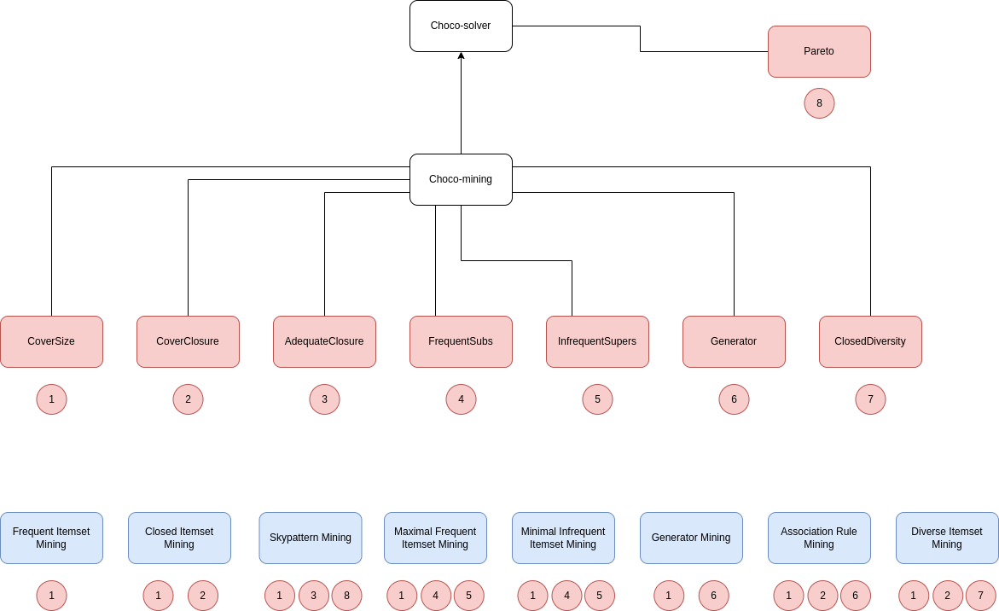

# Summary

Constraint Programming (CP) is a powerful tool for solving many different type of problems.
Recent years have seen many advances in the area, with the development of many different constraints.
In this paper, we introduce a new library for solving Itemset Mining problems with Choco Solver.             

## Constraint Programming (CP)
Constraint Programming (CP) is a powerful paradigm for solving combinatorial optimization problems. It provides a declarative approach to problem-solving by defining a set of variables, domains, and constraints that capture the problem's requirements. CP solvers explore the space of possible solutions systematically, leveraging powerful search algorithms and constraint propagation techniques to efficiently find valid solutions. The flexibility of CP allows for modeling a wide range of problems, including scheduling, resource allocation, planning, and configuration. Its ability to handle complex constraints, discrete variables, and global properties makes it particularly suitable for tackling real-world problems. CP has demonstrated remarkable success in various domains, offering a high-level modeling language and a diverse set of solving techniques. Its integration with other optimization methods and technologies further enhances its applicability and effectiveness. Overall, Constraint Programming is a valuable tool for addressing challenging optimization problems, offering a powerful approach to problem modeling, solving, and decision support.

## Itemset Mining

Itemset mining is a fundamental data mining technique that aims to extract meaningful associations and patterns from large datasets. It involves the identification of sets of items(called itemsets) that frequently co-occur or exhibit significant relationships. By uncovering these itemsets, researchers gain valuable insights into the underlying structure and dependencies within the data. Itemset mining finds applications in various domains, including market basket analysis, bioinformatics, and social network analysis.

## CP and Itemset Mining

In recent years, CP has been proven to be effective for modelling and solving Itemset Mining problems. The main advantage of using CP rather than specialised approaches for solving itemset mining problems is that the user can easily add custom constraints without having to modify the underlying system. Multiple constraints have been proposed in the literature to model and solve several itemset mining problems.

# Statement of need
Multiple constraints oriented to itemset mining have been proposed in the recent years. However, there exists few alternatives that gather all the constraints in the same place. A user interested by using constraints in its own project would have to implement them from scratch, which takes time and may lead to bugs. To alleviate the burden of the user, we propose a new CP module that gathers multiple reference constraints for itemset mining in the same place using Choco-solver, a reference CP library.

# Features and Functionality

# Acknowledgements

This project was funded by IMT Atlantique.

# References