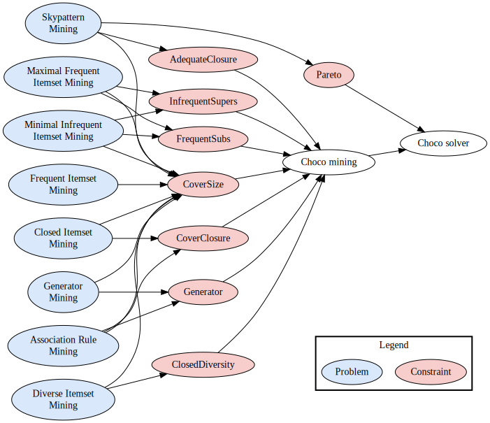

# Summary

While traditional data mining techniques have been used extensively for discovering patterns in databases, they are not always suitable for incorporating user-specified constraints. To overcome this issue, new research has began connecting Data Mining to Constraint Programming (CP).  Such fertilization leads to a flexible way to tackle data mining tasks, such as itemset or association rule mining. In this paper, we introduce a new library for solving itemset mining problems with Choco-solver.              

## Constraint Programming (CP)
Constraint Programming (CP) is a powerful paradigm for solving combinatorial optimization problems [@rossi2006handbook]. It provides a declarative approach to problem-solving by defining a set of variables, domains, and constraints that capture the problem's requirements. CP solvers explore the space of possible solutions systematically, leveraging powerful search algorithms and constraint propagation techniques to efficiently find valid solutions. The flexibility of CP allows for modeling a wide range of problems, including scheduling [@baptiste2001constraint], resource allocation [@zhang2013constraint], and planning [@van1999cplan]. Its ability to handle complex constraints, discrete variables, and global properties makes it particularly suitable for tackling real-world problems. CP has demonstrated remarkable success in various domains, offering a high-level modeling language and a diverse set of solving techniques. Its integration with other optimization methods and technologies further enhances its applicability and effectiveness. Overall, Constraint Programming is a valuable tool for addressing challenging optimization problems, offering a powerful approach to problem modeling, solving, and decision support.

## Itemset Mining

Itemset mining is a fundamental data mining technique that aims to extract meaningful associations and patterns from large datasets [@fournier2017survey]. It involves the identification of sets of items (called itemsets or patterns) that frequently co-occur or exhibit significant relationships. By uncovering these itemsets, researchers gain valuable insights into the underlying structure and dependencies within the data. Itemset mining finds applications in various domains, including market basket analysis [@agrawal1994fast], bioinformatics [@martinez2008genminer], and social network analysis [@erlandsson2016finding].

## CP and Pattern Mining

In recent years, CP has been proven to be effective for modelling and solving itemset mining problems [@guns2011itemset;@lazaar2016global;@ugarte2017skypattern], and sequence mining problems [@aaai12081;@seq2pat2022;@Frontiers2022;@DPM2022]. The main advantage of using CP rather than specialised approaches for solving pattern mining problems is that the user can easily add custom constraints without having to modify the underlying system. Multiple user-specified constraints have been proposed in the literature to model and solve several pattern mining problems.

# Statement of need
Having a generic prototypical approach that can be parameterized to declaratively and efficiently discover patterns of interest using the available constraint solving tools is crucial to promote the use of CP for itemset mining. Multiple constraints designed for different mining tasks have been proposed in the recent years. However, few alternatives exist that bring all of these constraints together in the same place. A user interested by using constraints in their own project would have to implement them from scratch, which takes time and may lead to bugs. To alleviate the burden of the user, we propose a new CP library that gathers multiple reference constraints for itemset mining in the same place.

# Features and Functionality



We propose a new CP library called **Choco-Mining** that is based on Choco-solver [@prud2022choco]. The architecture of the library is illustrated in \autoref{fig:app}. As we can see, multiple constraints dedicated to different itemset mining tasks are available in the Choco-Mining library. Each constraint takes as input a transactional database $D$ and a vector of Boolean variables $x$ used for representing itemsets, where $x[i]$ represents the presence/absence of the item $i$ in the searched itemset. These constraints are then used to define the problem at hand in terms of constraint programming. The following constraints are available in Choco-Mining:

- $CoverSize_{D}(x,f)$ [@SchausAG17]: Given an integer variable $f$ that represents the frequency (noted $freq$) of an itemset $x$, the constraint ensures that $f = freq(x)$.
- $CoverClosure_{D}(x)$ [@SchausAG17]: The constraint ensures that $x$ is closed w.r.t. the frequency, i.e., $\nexists ~y \supset x: freq(x) = freq(y)$.
- $AdequateClosure_{D,M}(x)$ [@ijcai2022p0261]: Given a set of measures $M$, the constraint ensures that $x$ is closed w.r.t. $M$, i.e., $\nexists~ y \supset x$ such that for all $m \in M : m(x) = m(y)$.
- $FrequentSubs_{D,s}(x)$ [@Belaid2BL19]: Given a frequency threshold $s$, the constraint ensures that all the subsets of $x$ are frequent, i.e., $\forall y \subset x : freq(y) \ge s$.
- $InfrequentSupers_{D,s}(x)$ [@Belaid2BL19]: Given a frequency threshold $s$, the constraint ensures that all the supersets of $x$ are infrequent, i.e., $\forall y \supset x : freq(y) < s$.
- $Generator_{D}(x)$ [@BelaidBL19]: The constraint ensures that $x$ is a generator, i.e., $\nexists ~y \subset x : freq(y) = freq(x)$.
- $ClosedDiversity_{D,\mathcal{H},j,s}(x)$ [@HienLALLOZ20]: Given a history of itemsets $\mathcal{H}$, a diversity threshold $j$ and a minimum frequency threshold $s$, the constraint ensures that $x$ is a diverse itemset (i.e., $\nexists ~y \in \mathcal{H} : jaccard(x,y) \ge j$), $x$ is closed w.r.t. the frequency and $freq(x) \ge s$.

We can model different problems using these constraints. \autoref{fig:app} shows examples of mining tasks (in blue) with the constraints (in red) involved in their modelling:

- Frequent Itemset Mining: Given a threshold $s$, find all the itemsets $x$ such that $freq(x) \ge s$.
- Closed Itemset Mining: Given a threshold $s$, find all the itemsets $x$ such that $freq(x) \ge s$ and $\nexists ~y \supset x : freq(x) = freq(y)$.
- Skypattern Mining: Given a set of measures $M$, find all the itemsets $x$ such that there exists no other itemset $y$ that dominates $x$. We say that $y$ dominates $x$ iff $\forall ~m \in M : m(y) \ge m(x)$ and $\exists ~m \in M : m(y) > m(x)$.
- Maximal Frequent Itemset Mining: Given a threshold $s$, find all the itemsets $x$ such that $freq(x) \ge s$ and $\forall ~y \supset x : freq(y) < s$.
- Minimal Infrequent Itemset Mining: Given a threshold $s$, find all the itemsets $x$ such that $freq(x) < s$ and $\forall ~y \subset x : freq(y) \ge s$.
- Generator Mining: Find all the itemsets $x$ such that $\nexists ~y \subset x : freq(y) = freq(x)$.
- Association Rule Mining: Find all the association rules $x \Rightarrow y$ that respect the constraints specified by the user.
- Diverse Itemset Mining: Given a diversity threshold $j$ and a minimum frequency threshold $s$, find all the diverse itemsets that are closed w.r.t. the frequency and such that $freq(x) \ge s$.

# Running example

We give below an example of CP encoding for the Closed Itemset Mining problem using our library Choco-Mining.

```java
// Read the transactional database
TransactionalDatabase database = new DatReader("data/contextPasquier99.dat").read();
// Create the Choco model
Model model = new Model("Closed Itemset Mining");
/* Array of Boolean variables where x[i] == 1 represents
the fact that i belongs to the itemset */
BoolVar[] x = model.boolVarArray("x", database.getNbItems());
/* Integer variable that represents the frequency of x 
with the bounds [1, nbTransactions] */
IntVar freq = model.intVar("freq", 1, database.getNbTransactions());
// Integer variable that represents the length of x with the bounds [1, nbItems]
IntVar length = model.intVar("length", 1, database.getNbItems());
// Ensures that length = sum(x)
model.sum(x, "=", length).post();
// Ensures that freq = frequency(x)
ConstraintFactory.coverSize(database, freq, x).post();
// Ensures that x is a closed itemset
ConstraintFactory.coverClosure(database, x).post();
Solver solver = model.getSolver();
// Variable heuristic : select item i such that freq(x U i) is minimal
// Value heuristic : instantiate it first to 0
solver.setSearch(Search.intVarSearch(
        new MinCov(model, database),
        new IntDomainMin(),
        x
));
// Create a list to store all the closed itemsets
List<Pattern> closedPatterns = new LinkedList<>();
while (solver.solve()) {
    int[] itemset = IntStream.range(0, x.length)
            .filter(i -> x[i].getValue() == 1)
            .map(i -> database.getItems()[i])
            .toArray();
    // Add the closed itemset with its frequency to the list
    closedPatterns.add(new Pattern(itemset, new int[]{freq.getValue()}));
}
System.out.println("List of closed itemsets for the dataset contextPasquier99:");
// Print all the closed itemsets with their frequency
for (Pattern closed : closedPatterns) {
    System.out.println(Arrays.toString(closed.getItems()) +
            ", freq=" + closed.getMeasures()[0]);
}
```

The goal is to find all the closed itemsets with a minimum frequency of 1. We start by reading the transactional database using the method `read()` of the `DatReader` instance. Then, we create a model with Choco-solver. Variables `freq` and `length` are created to store respectively the frequency and the length of the itemset. A boolean array of variables `x` represents the itemset, where `x[i] = 1` indicates that item `i` belongs to the itemset. Finally, we post three constraints:

- `model.sum(x, "=", length).post()`: ensures that $length = \sum x$.
- `ConstraintFactory.coverSize(database, freq, x).post()`: ensures that $freq = freq(x)$.
- `ConstraintFactory.coverClosure(database, x).post()`: ensures that $x$ is closed w.r.t. the frequency.

After finding all the solutions, we print them to the user.

# Acknowledgements

This project was funded by IMT Atlantique.

# References
